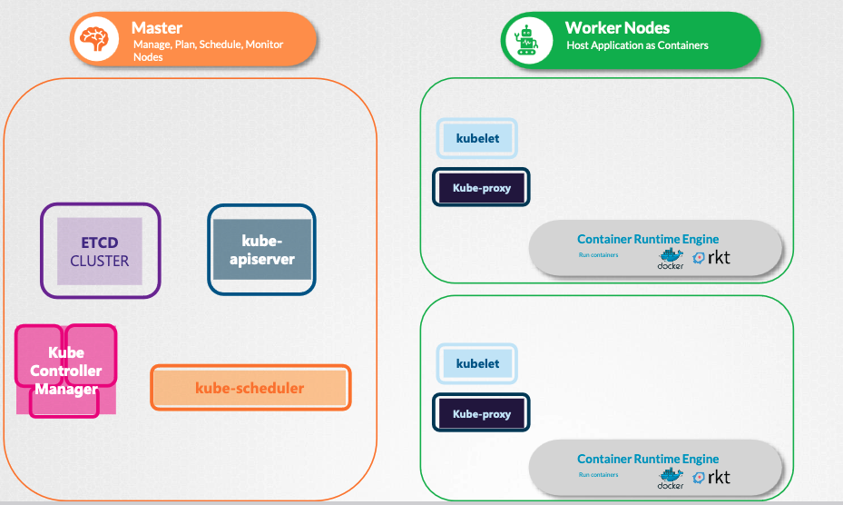

## Cluster Architecture

- Etcd cluster, which stores information about the cluster.
- Kube scheduler that is responsible for scheduling applications or containers on nodes.
- Different controllers that take care of different functions like the node controller, replication controller, etc.
- Kube API server that is responsible for orchestrating all operations within the cluster.
- Kubelet that listens for instructions from the Kube API server and manages containers 
- Kube Proxy that helps in enabling communication between services within the cluster.

